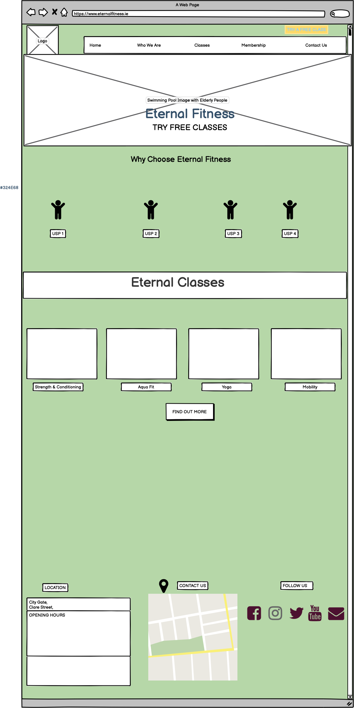
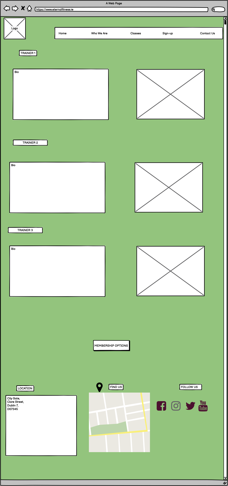

# Eternal Fitness

 <a href="https://margaret027.github.io/eternalfitness/"> Live website</a> 
## About Eternal
Fitness is a class-based fitness centre to encourage and promote an active lifestyle for the mature population. Sedentary behaviour has long been associated with higher risk of cardiovascular disease and chronic disease. Only 30 minutes of moderate intensity aerobic exercise per day can improve mood, self-esteem and overall mental health on top of the physical benefits, according to the Irish Nutrition and Dietetic Institute. The concept behind Eternal Fitness is to reach out to populations of people who may feel intimidated by traditional gyms or lack knowledge. To make Eternal Fitness accessible to all, not matter what your age or fitness level, the class-based model works in accordance with activity level recommendations for older adults (50+). A combination of moderate, vigorous and muscle-strengthening exercise is a great recipe for fitness into older age and a great place for beginners to get into physical fitness.  Eternal Fitness operates a class only style gym experience. This model reduces overhead costs of having to pay staff and services for long hours with potentially low customer volume during non-peak times, from a business perspective. From a user perspective, with the populations I will be targeting we envisage that they will experience; 
1. Motivation from being around like-minded people 
2. Structured well rounded classes based on fitness coach recommendations (ie including warm ups and cool downs 
3. Ensures proper form and guidance, thus reducing the chance of injury 
4. Variety to prevent boredom and keep the body challenged 
5. Accountability for keeping fit and sticking to a routine 
6. Fun and enjoyable way to exercise 

# UX
This website was created with the target customer in mind – an older, more mature customer seeking a solution to meet both fitness and social needs. Extensive use was made of pale, light and calming colours, recessive images and a friendly, welcoming and non-judgemental tone of voice. The wireframe and user journey focuses on clear and fuss free landing pages that are easy to navigate through with limited number of clicks. The aim for the end user/target audience is to feel comfortable when browsing the website and therefore be encouraged to take an action on the site such as filling out the Contact Form for more information, Booking a Free Trial or signing up to a membership plan. I have implemented the following:
There are CTA’s on the home page, such as the Contact Us and Book a Free Trail. These CTA’s use contrasting colours to the main theme colour in order to jump out of the page and thus more likely to be clicked. 
The social media icons at the footer of the page are clearly identifiable. 
Location and Contact Details are also positioned at the bottom of the home page and also across the rest of the site’s pages. This ensures a demonstrates a consistent design which is a general rule of thumb for effective web design and UX. 

* A sign up page for the user to register to receive information on new music releases, tours, ticket releases etc.
* Biography section on the Personal Trainers to evoke trust. 
* A Membership page so users can choose to book from different class plans. 
* Social media links for users can follow us and keep up to date with the latest news, special offers tips and nutrition information. 

# Wireframe Mockups
These can be found at the following links below:
1. 
2. 
3. 
4. 
5. 

# Features
### Home Page
* **Nav Bar**- Easy to navigate Nav bar with simple hover effect.
* **Hero Image** chosen to target the over 50’s potential gym goer’s or those in their 50’s looking to improve their health and lifestyle. 
* **Call to Action** “Call US” to entice visitor to take action on website.
* **Call to Action** “Give it a try” to encourage visitors to book a free class and test out classes out for themselves. 
* **Eternal Fitness Ethos** /Unique Selling Points to highlight the advantages of Eternal Fitness and why they should choose this gym. Icons used to give a nice visual representation. 
* **Classes Intro Section** – To give people an insight into classes followed by again another CTA “Membership Offers” to encourage visitors to take further action on this site. 
### About Us
* **Personal Trainer Bio’s** to give visitors background info on the trainers to evoke credibility and so intent to book. 
* **Call to Action Button** “ Get In Touch” to encourage visitors to click and enquire about PT sessions/ or classes. 
### Classes
* Clear and legible class descriptions with image of class on right hand side. 
* **Call to Action Button** “ Class Timetable” so visitors can get a feel for the classes and warmed up to take further action on website. 
### Membership
* 3 clear and legible membership options presented in a bootstrap card deck.
* Call to Action Buttons “Price” and Book Now” linking directly to paypal.com to make payment for membership of choice and therefore leading visitor to the preferred action on the website. The simple format and presentation allows for an easy booking process. 
* “Contact Us” button should users want to enquire/ find out more. 
### Contact Us 
* Contact Us Form so that users can get in touch directly with the Eternal Fitness Team. 
### Footer
* **Social Media Links** - this feature allows users to follow us on Facebook, Twitter and Youtube for all the latest news
* **Embedded Google MAP Find US** - to easily find our Location
* **Contact Details** to get un touch with us Address, Email and phone details provided.
# Future Features
* Add client tetimonials to homepage
* Add "sign up to members newsletter" form to encourage customer engagement and loyalty
* Add website copyright at footer of website
* Add SSL certificate for secure payment and also cookie policies and GDPR compliance notification also for security.

 
# Technologies Used
* **HTML5:** This was used as the layout to fully build the website
* **CSS:** This was used to style the website
* **Bootstrap:** This was used to get the overall clean layout and grids were used to help with 
* **GitHub:** Version control and hosting of the code. 
* **GitPod:** Allows you to develop, build, and run the application all on the cloud in the web browser. 
* **Font Awesome** for icons
**Google Fonts** for website fonts

# Testing
Using Bootstrap classes and some CSS, the UI adapts to the screen size. E.g. on mobile the header nav menu disappears behind a button. On mobile elements in the footer take up a full row while on desktop all the elements fit on one row. On the homepage the images in the classes section scale for screen size. On small screens one image fits per row, on medium screens 2 images per row, on large screens they all fit in one row. On the Membership page the 3 membership options scale based on screen size.
Also used W3SSchools code verifier. and Google Dev tools.
* **Links** All external links were tested to make sure they open up the correct pages in new tabs
* [Code Validation W3C](https://validator.w3.org/)

# Deployment
This section should describe the process you went through to deploy the project to a hosting platform (e.g. GitHub Pages or Heroku).
In particular, you should provide all details of the differences between the deployed version and the development version, if any, including:
* Different values for environment variables (Heroku Config Vars)?
* Different configuration files?
* Separate git branch?
In addition, if it is not obvious, you should also describe how to run your code locally.

# Credits
 * https://validator.w3.org/ I used this royalty free stock image site to get all my website images 
 * [Canva](https://www.canva.com/) I used this site to create the logo and also sample timetable 
 * [Pixlr](https://pixlr.com/) I used this site to resize the images on the website 
 * I wrote all the content of the website much of which originated from my previous project in Digital Marketing.  (Link can be found in the acknowledgements) I wrote the content in a simple and clear way that is easily understandable and also key words used throughout to assist with SEO and rankings on the SERP in general so that with time the site could rank organically. A future blog with regular SEO friendly content would further accelerate rankings. 

# Media
* The photos used in this site were obtained through [Pexels](https://www.pexels.com/)  a royalty free website with a vast selection of free stock images. I choose keywords related to the fitness industry to find the appropriate images for the website. 
# Acknowledgements
* I received inspiration for this project from a previous project I completed as part of my Certificate in Digital Marketing at DBS. Part of our assignment was to create a website for a fictional business of our choice using weebly.com or wix which are user friendly front end drag and drop formatting and do not require any coding. Upon completion of this project I was curious to discover how to code my own website coupled with my passion for health and fitness particularly as we get older. [Click here](https://flourishgym.weebly.com/) to access my previous project created through Weebly.com. 
 
